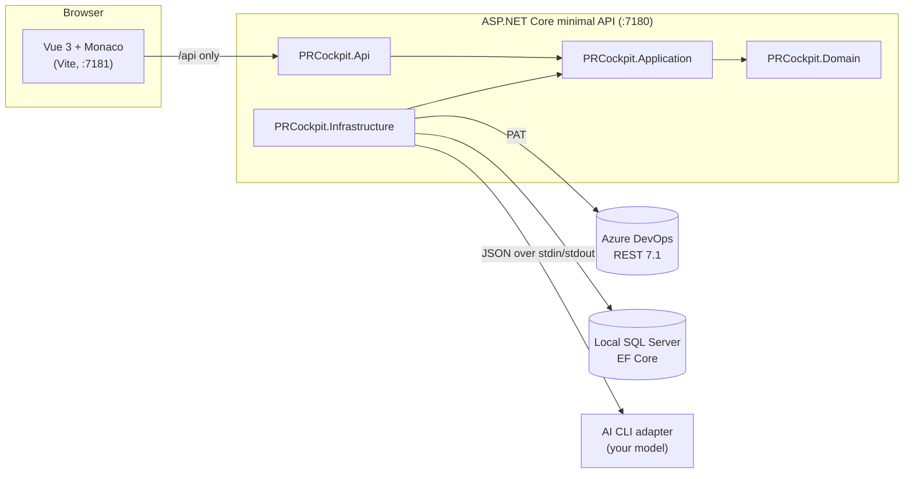

<div align="center">

# 🛩️ PR Cockpit

**Understand the pull request, not just skim the diff.**

A personal cockpit for reviewing large, AI-generated pull requests on Azure DevOps —
reading order, AI summaries, per-file explanations and a checklist, so you keep the
mental model of your system while the code ships faster than you can read it.


[Why](#-why) · [Features](#-features) · [Architecture](#-architecture) · [Quick start](#-quick-start) · [Configuration](#-configuration) · [Development](#-development)

</div>

---

## 🤔 Why

With AI writing code, pull requests pass tests and AI review — but they arrive with dozens or
hundreds of files, and you end up *browsing* the diff instead of *understanding* it. A few weeks
later nobody remembers where the logic lives or why it works the way it does.

PR Cockpit does **not** replace code review. It answers the comprehension questions after each PR:
*what changed, why, which files really matter, where do I start reading, where would I start debugging.*

> Product context (in Polish): [PRODUCT.md](PRODUCT.md) · Task list: [docs/BACKLOG.md](docs/BACKLOG.md) · Design record: [docs/ARCHITECTURE.md](docs/ARCHITECTURE.md)

## ✨ Features

| | |
|---|---|
| 🧭 **Guided walk-through** | Step through a PR file by file in a suggested reading order — code first, noise (lockfiles, generated code) moved to the end. Resume where you left off. |
| 🤖 **AI Summary on demand** | 2–5 sentences about the whole PR plus the critical files, each with its role and why it matters. Generated only when you click, stored locally. |
| 💡 **Explain this file / Ask** | A short explanation of one file, or ask a question about the file on screen (optionally about a highlighted snippet) and keep the conversation. |
| 🔍 **Monaco diff with C# hovers** | Side-by-side diff with Roslyn-powered hovers and semantic colors for C#. |
| ✅ **Reviewed markers** | Mark files as reviewed; the marker survives unrelated commits and only goes stale when *that* file changes. |
| 🔁 **"What changed since…"** | Filter to what arrived after iteration N, or since your last walk-through or a given comment. |
| 💬 **Comment threads** | Read Azure DevOps threads in place, see them marked in the file tree and diff; write and resolve them when explicitly enabled. |
| 📋 **Six-step checklist** | A manual per-PR checklist, with progress shown on the active PR list. |

## 🏗️ Architecture



- **Fetched on demand.** No sync, no cache of Azure DevOps data. Only your own state is persisted: checklist, Summary, reviewed markers, reading path and AI conversations.
- **The PAT never leaves the backend.** The frontend talks only to `/api`.
- **Bounded, never truncated.** Files over the diff or AI-context budget keep their path and an omission reason; text is dropped whole, never cut mid-file.
- **Untrusted text stays data.** PR descriptions, commit titles and code go to the model in a `context` field, separate from the fixed `instruction`.
- **Clean Architecture, enforced.** Dependencies point inwards; `ArchitectureTests` fails the build if a layer is crossed.

## 🚀 Quick start

**Requirements:** .NET SDK 10 · Node.js 24 · a local SQL Server · an Azure DevOps PAT with **Code (Read)** and **Project and team (Read)**.

```powershell
# 1. Secrets (stored outside the repo)
dotnet user-secrets set "AzureDevOps:Organization" "your-organization" --project backend/PRCockpit.Api
dotnet user-secrets set "AzureDevOps:Pat" "YOUR_PAT" --project backend/PRCockpit.Api
dotnet user-secrets set "ConnectionStrings:PrCockpit" "Server=.;Initial Catalog=PrCockpit;Trusted_Connection=True;TrustServerCertificate=True" --project backend/PRCockpit.Api

# 2a. One click: puts a "PR Cockpit" shortcut on the desktop
./scripts/install-shortcut.ps1
```

<details>
<summary><b>2b. Or run it in two terminals</b></summary>

```powershell
# terminal 1 — backend on http://localhost:7180
dotnet run --project backend/PRCockpit.Api --launch-profile http

# terminal 2 — frontend on http://localhost:7181 (proxies /api)
cd frontend
npm ci
npm run dev
```

Health check: `http://localhost:7180/api/health`.

</details>

The shortcut runs [`scripts/start.ps1`](scripts/start.ps1): it frees ports 7180/7181, runs `npm ci` if needed, starts
both servers in one console and opens the browser. Close the window or press Ctrl+C to stop both. Rerun the installer
after moving the repository; drop an `icon.ico` next to the script to change the icon.

## ⚙️ Configuration

<details>
<summary><b>🔐 Azure DevOps</b></summary>

`Organization` is the name from `https://dev.azure.com/<organization>`, not the full URL. Instead of User Secrets you can
set `AzureDevOps__Organization` and `AzureDevOps__Pat` (see [.env.example](.env.example)); `.env` is git-ignored and not
loaded automatically. Never put the PAT in `appsettings.json` or the frontend.

Linked work item IDs are read through the Git API, so **Work items (Read)** is not needed.

This setup is for local development. Sharing the app with other users would require Microsoft Entra sign-in, API
authorization and per-user token handling.

</details>

<details>
<summary><b>💬 Writing comments (off by default)</b></summary>

Reading threads needs nothing extra. **Writing** is off by default, because a comment is visible to the whole team and
cannot be taken back:

```powershell
dotnet user-secrets set "AzureDevOps:AllowComments" "true" --project backend/PRCockpit.Api
```

The PAT also needs **PR threads (read & write)**. Leave **Code** on Read — `vso.code_write` would also allow pushing code
and deleting refs, which this app never does. With the switch off or the scope missing, the backend refuses the write
before any request leaves the machine and says which of the two is wrong.

</details>

<details>
<summary><b>🗄️ Local database</b></summary>

State is stored through EF Core in the SQL Server database named by `ConnectionStrings:PrCockpit`
(`ConnectionStrings__PrCockpit` as an env var). Give it an explicit `Initial Catalog` — without one, EF Core uses the
login's default database and creates its tables there. Migrations run on start.

Records are keyed by organization, project, repository ID and PR ID. A reviewed marker stores the blob id of the file it
was set on, so it is reported as out of date only when that file's content actually changed.

</details>

<details>
<summary><b>🤖 AI adapter (Summary, Explain, Ask)</b></summary>

AI runs only when you ask for it. Point the backend at a trusted CLI program:

```powershell
dotnet user-secrets set "Ai:Summary:Executable" "C:\path\to\summary-adapter.exe" --project backend/PRCockpit.Api
dotnet user-secrets set "Ai:Summary:Model" "your-model-id" --project backend/PRCockpit.Api
```

[`scripts/summary-adapter.mjs`](scripts/summary-adapter.mjs) is a working reference adapter.

| Setting | Meaning |
|---|---|
| `Ai:Summary:Arguments:0`, `:1`, … | Literal arguments, one per entry |
| `Ai:Summary:TimeoutSeconds` | Default 600, allowed 1–1800 — a ~100-file PR takes a while |
| `Ai:Summary:AskModel` | Separate model for questions; falls back to `Model` |

The executable is started directly, without a shell, in the backend's directory. It never receives a repository path or
repository tools.

**Protocol.** One JSON object on stdin with `task`, `schemaVersion: 2`, `model`, a fixed `instruction` and the bounded
`context`. The program writes **only** one JSON object to stdout; diagnostics go to stderr.

`task: "summary"` — the whole PR:

```json
{"schemaVersion":2,"sentences":["Pierwsze zdanie.","Drugie zdanie."],
 "criticalFiles":[{"path":"/src/Foo.cs","role":"Nowy walidator.","why":"Tu jest reguła, którą zmienia ten PR."}],
 "readingOrder":["/src/Foo.cs","/src/Bar.cs","/package-lock.json"]}
```

`task: "file"` — the context holds exactly one file; `task: "ask"` — the context holds that file, the `question`, an
optional `selection` and the earlier turns in `history` (oldest first). Both answer with:

```json
{"schemaVersion":2,"sentences":["Ten fragment pilnuje limitu znaków."]}
```

**Validation rules**

- Sentences: summary 2–5, file 1–3, ask 1–6; each nonempty, at most 500 characters.
- `criticalFiles` is strict: every `path` copied exactly from `context.changedFiles` (an invented or repeated path fails
  the whole response), `role` and `why` nonempty and ≤ 200 characters, at most one file per four changed ones
  (never fewer than 10, never more than 25 — the same number is in the `instruction`). Empty or missing is allowed.
- `readingOrder` is a hint: unknown or repeated paths are dropped, missing ones appended, noise moved to the end. Empty or
  missing means the backend orders the PR itself.
- Anything else, including `schemaVersion: 1`, is rejected.

PR descriptions, commit titles, code, questions, selections and earlier turns are data, never instructions. Results are
validated, then stored, so reopening a PR shows the saved Summary without running the model again. The UI shows how many
diffs were included and which files were omitted.

</details>

## 🧪 Development

```powershell
dotnet build PRCockpit.slnx
dotnet test PRCockpit.slnx

cd frontend
npm test          # vitest
npm run build     # vue-tsc --noEmit + vite build
npm run visual:baseline   # screenshots before a UI change (headless Chrome/Edge)
npm run visual            # screenshots after it, compared pixel by pixel
```

Backend tests use HTTP fakes; frontend tests use a simulated DOM and a mocked API. Neither needs an Azure DevOps account —
and neither replaces checking a real pull request or the layout in a browser. `npm run visual` catches layout regressions on fixture data (`frontend/visual/`), still not on a real pull request.

```text
backend/
├── PRCockpit.Domain          models and rules, no external technology
├── PRCockpit.Application     ports and use cases
├── PRCockpit.Infrastructure  Azure DevOps client, Roslyn, EF Core, stores
└── PRCockpit.Api             host, routes, failure mapping
frontend/                     Vue 3 + TypeScript + Monaco
tests/PRCockpit.Api.Tests     backend and architecture tests
scripts/                      launcher, desktop shortcut, reference AI adapter
docs/                         architecture, backlog, specs (Polish)
```

> The PR list shows creation dates — the Azure DevOps list endpoint used here does not return a PR's last update date.
